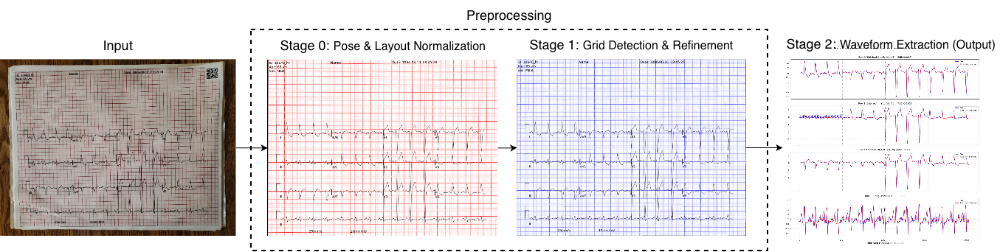
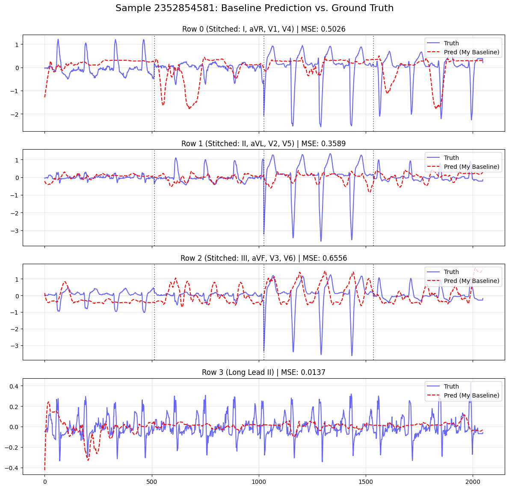
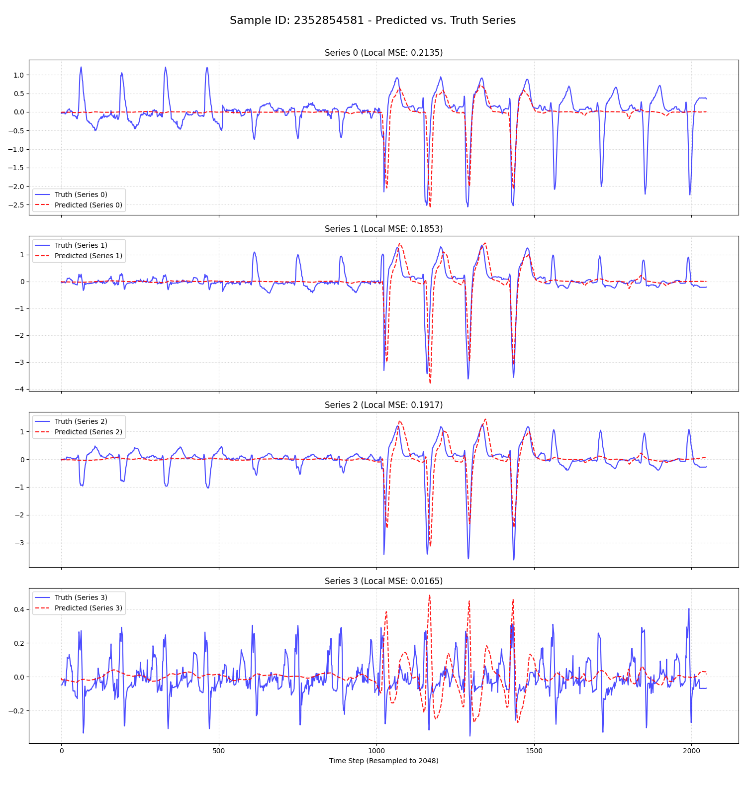
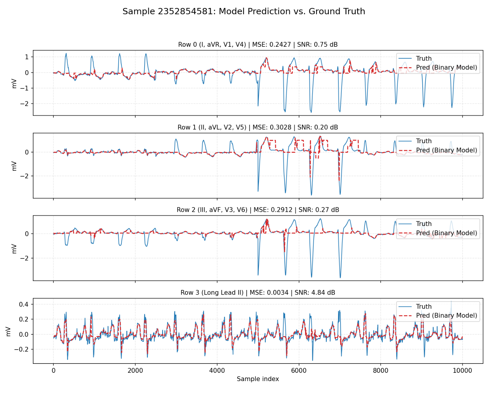
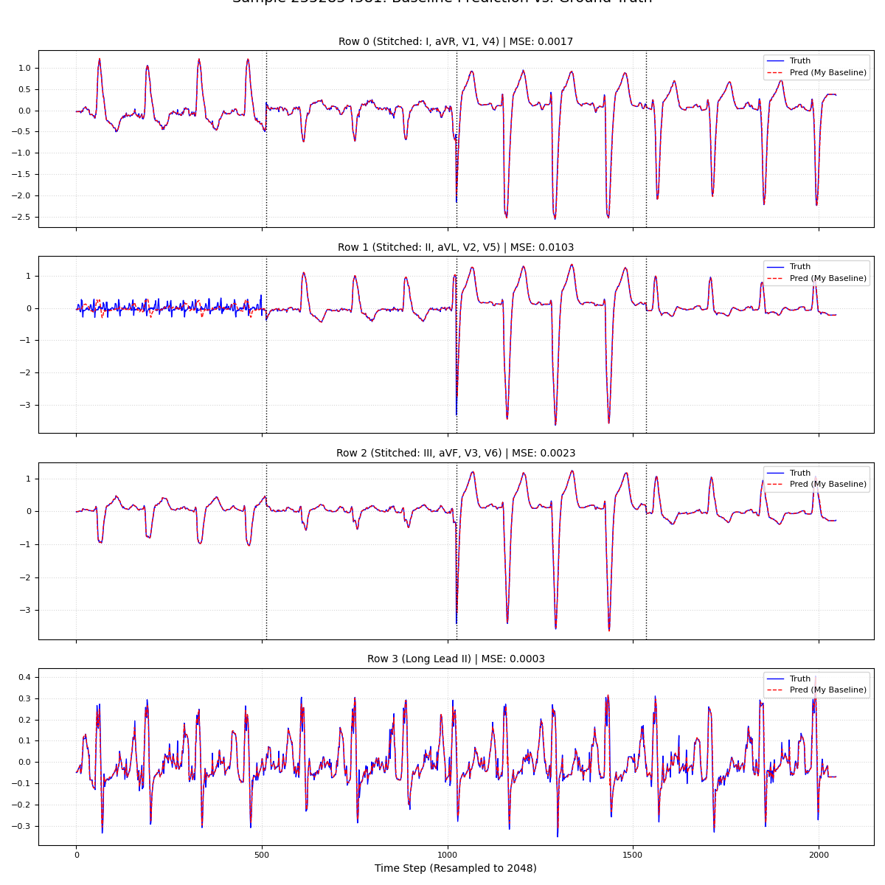

Billions of legacy ECG records still live as paper charts and scanned PDFs, locked away from modern analysis. This project trains a machine learning pipeline that takes a **photograph of a paper ECG printout** and reconstructs the underlying **12-lead voltage time series** — bringing decades of cardiology archives back into the realm of algorithmic analysis.

Built for CIS 5200 (Applied Machine Learning, UPenn, Fall 2025) as *Team Unsupervised*, with Yiru Zhou and Boyan Zhang.

## Problem

A printed ECG looks structured — a known 12-lead grid layout on red-pink graph paper — but real-world scans rarely cooperate. Paper folds, perspective distortion, gridline drift, handwritten annotations, and uneven lighting all corrupt the linear mapping between pixel coordinates and voltage/time. The task is a *supervised structured regression*: given an image $X \in \mathbb{R}^{H \times W \times 3}$, recover the 12-lead waveform $\{y^{(l)}\}_{l=1}^{L}$ with $y^{(l)} \in \mathbb{R}^{T_l}$.

We use the **PhysioNet ECG Image Digitization** dataset from Kaggle (~1000 image-signal pairs, 12 leads at 500 Hz, 10–15 s per record). A naive end-to-end regression on raw pixels fails because the geometric distortions propagate into voltage error. The fix is to decompose the problem.

## Three-stage pipeline

Following Krones et al. (2024), we split the problem into preprocessing and waveform extraction.

**Stage 0 — Global geometric normalization.** A ResNet-18 encoder feeds a U-Net decoder to predict lead position keypoints. Test-time augmentation refines the heatmap; connected-component analysis extracts keypoints; **RANSAC** estimates a homography to a canonical 1152 × 1440 reference frame.

**Stage 1 — Local non-linear rectification.** A multi-task U-Net (`Stage1Net`) jointly predicts (a) a gridpoint probability map and (b) horizontal/vertical line segmentation. Connected component analysis recovers the distorted paper mesh; a non-linear warping aligns it to an ideal Euclidean grid, undoing paper wrinkles and curvature.

**Stage 2 — Waveform extraction.** Pixel-wise regression of the vertical location of each ECG trace for every horizontal time coordinate, supervised by

$$
\mathcal{L} = \sum_{l=1}^{L} \| y^{(l)} - \hat{y}^{(l)} \|_2^2.
$$

The predicted pixel series is mapped to millivolts via the grid scale recovered in Stage 1.

## Methods we compared

For Stage 2 we evaluated four architectures spanning the regression-vs-segmentation spectrum.

### Method 1 — Context-Aware Random Forest (baseline)

A non-deep regression baseline: each image column is encoded as a 15-dimensional descriptor — weighted center of mass, vertical dispersion, and statistics from adjacent columns for short-range continuity — then fed to a Random Forest regressor (scikit-learn, 50 trees, max depth 10). Post-processing: Savitzky-Golay smoothing + global mean subtraction. Useful as an interpretable lower bound; struggles fundamentally with thin, high-curvature ECG morphology.

### Method 2 — Residual 1D CNN

End-to-end image-to-signal: a pretrained **ResNet-34** (timm) encodes the rectified image; a 1×1 conv reduces channels; adaptive average pooling collapses the vertical dimension into a temporal feature sequence; a lightweight 1D Conv-ReLU stack decodes it to per-lead voltage traces. Trained AdamW, LR 1e-4, batch 12, AMP, 3 epochs. The 1D decoder is efficient and captures temporal dependencies, but the average-pool over the vertical axis discards the precise lead-row geometry — high-precision pixel-level regression isn't its strength.

### Method 3 — Baseline-Aware Binary Segmentation U-Net (ours)

Treat the problem as **pixel-level segmentation** rather than regression. A ResNet-18 encoder + 4-stage decoder + classification head outputs a $4 \times H \times W$ probability map (one channel per ECG row group). The decoder features are concatenated with three explicit spatial embeddings:

1. A normalized y-coordinate map,
2. A signed distance-to-baseline embedding for each channel's 0 mV reference line,
3. Soft channel-indicator maps from Gaussian proximity to each baseline.

These embeddings let the model disambiguate vertically stacked leads and suppress false positives far from any baseline. The loss combines **Dice + Focal + BCE** (weighted 2.0/0.5/0.1) plus a spatial penalty for baseline-inconsistent predictions. ImageNet-pretrained encoder, AdamW LR 1e-4, ReduceLROnPlateau, 100 epochs with patience-15 early stopping. Mixed precision; horizontal flips, brightness jitter, Gaussian noise augmentation.

### Reference Prior — Large-Scale Coordinate-Augmented ResUNet

For reference we reproduced Krones et al.'s ResNet-nnUNet variant, trained on **tens of thousands of synthetic ECG images** rendered from PTB-XL time series with synthetic grids, color shifts, wrinkles, shadows, and annotations. Pixel-level masks come for free from the rendering pipeline.

## Results

Performance measured on the held-out 20% split, using cross-correlation–aligned **Signal-to-Noise Ratio (SNR)** and **Mean Squared Error (MSE)**:

$$
\text{SNR} = 10 \log_{10} \left( \frac{\sum_i V_{\text{true},i}^2}{\sum_i (V_{\text{true},i} - V_{\text{opt},i})^2} \right)
$$

| Method | MSE (mV²) | SNR (dB) |
| --- | ---: | ---: |
| Context-Aware Random Forest (baseline) | 0.110 | −10.92 |
| Residual 1D CNN | 0.034 | 0.69 |
| **Baseline-Aware Binary Segmentation (ours)** | 0.276 | **5.57** |
| Reference Prior: Large-Scale Coord-Aug ResUNet | 0.0014 | **16.42** |

The result that matters: **pixel-wise dense prediction beats sequence-to-sequence regression on signal fidelity**, even though our segmentation network's per-pixel MSE looks worse — MSE is dominated by the large background area, while SNR is what cardiologists actually care about. The reference ResUNet wins overall, but it's trained on tens of thousands of synthetic images vs. our <1000 real ones — so the right takeaway is *architecture and data scale matter together*.

## What we learned

*Decomposition beats end-to-end.* Initial attempts at a single black-box image-to-signal regressor failed badly. The three-stage formulation — pose normalization, grid detection, waveform extraction — is what made any of our methods work at all. Each stage has interpretable intermediate outputs that can be debugged independently.

*Class imbalance is the real bottleneck for segmentation.* QRS complexes — the spikes cardiologists look at first — are an extreme minority in pixel space. The Dice + Focal + BCE combination plus the SNR-based auxiliary loss helps, but our model still systematically underfits sharp deflections. Scaling the synthetic data, as the reference method does, is the obvious next step.

*Treating each column independently throws away signal.* The Random Forest baseline's biggest weakness was its column-wise feature extraction: it can't see across the time axis to learn that QRS complexes have a stereotyped shape. Deep models that share weights across columns implicitly capture this.

## Future work

Massive synthetic data augmentation (PTB-XL signals → ECG-Image-Kit renderings) to balance the QRS-minority class problem, plus a curvature-aware loss term — penalizing the second derivative of the predicted waveform near the ground-truth spike locations — to nudge the model toward sharper QRS reconstruction without rebalancing the entire dataset.

Course: CIS 5200 Applied Machine Learning, UPenn, Fall 2025. Team Unsupervised: Zijin Zhou, Yiru Zhou, Boyan Zhang.
