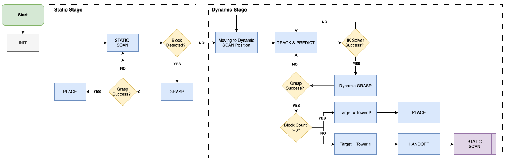

## Project scope

  

    <video style="width: 100%; height: auto; border-radius: 10px;" controls muted autoplay loop playsinline preload="metadata">
      <source src="demo_5x.mp4" type="video/mp4">
    </video>
    5x
  

  

    Developed for the UPenn MEAM 5200 Final Competition, this project required the <strong>Franka Emika Panda</strong> arm to autonomously detect, pick, and stack blocks to build the tallest tower. The system had to handle:
    <ul>
      <li><strong>Static Environment:</strong> Precision stacking of scattered blocks.</li>
      <li><strong>Dynamic Environment:</strong> Grasping moving targets on a rotating turntable with unknown speed.</li>
    </ul>
     <strong>My Role:</strong> Motion Planning (IK), State Machine Architecture, Sim-to-Real Deployment.
  

---

## Kinematics

The arm's forward kinematics use the standard **Denavit–Hartenberg** convention, with parameters derived from the Franka datasheet — composing per-joint homogeneous transforms $T_n^0(\mathbf{q}) = \prod_{i=1}^{7} T_i^{i-1}(q_i)$.

Since the arm is 7-DOF and target poses come from perception (not analytical waypoints), I built a **numerical IK solver** using gradient descent on the Jacobian pseudoinverse, with a null-space joint-centering task that biases the solver away from joint limits:

$$
\Delta q = -\alpha\, J^{+}\,\xi + (I - J^{+}J)\,b
$$

where $J$ is the $6 \times 7$ analytical Jacobian, $\xi$ is the spatial twist between current and target poses, and $b$ is the joint-centering velocity. A 100-iteration cap matters in the dynamic stage — if IK can't converge in time, the target has moved past the intercept window, so we abort and re-predict rather than burn real time on a stale grasp.

Block poses come from AprilTag detections on a wrist-mounted RGB camera, transformed into the robot base frame via calibrated hand–eye offsets.

---

## Core algorithms

### 1. Top-down grasp pose from block orientation

For each detected block (rotation $R_\text{block} = [\mathbf{c}_1, \mathbf{c}_2, \mathbf{c}_3]$), the grasp pose picks the body axis most aligned with world-z as the top face, then the remaining axis best aligned with the base x-axis as the gripper opening direction:

$$
k = \underset{i}{\arg\max}\; |\mathbf{c}_i \cdot \mathbf{z}_\text{world}|,
\qquad
\mathbf{v}^{*} = \underset{\mathbf{v} \in \{\mathbf{c}_j\}_{j \neq k}}{\arg\max}\; |\mathbf{v} \cdot \mathbf{x}_\text{base}|
$$

This keeps wrist yaw consistent across grasps and the arm in a high-manipulability part of its workspace. A pre-grasp waypoint 15 cm above the target prevents collisions on approach; a gripper-width check (`w_final > ε_min_width`) validates each grasp before declaring success.

### 2. Dynamic trajectory prediction

To grasp objects on a moving turntable, I implemented a kinematic prediction model. The turntable rotates about center $C$ with constant angular velocity $\omega$; over a feedforward horizon $\Delta t$ (camera latency + IK time + execution time), both position and orientation rotate rigidly:

$$
P_\text{pred} = R_z(\omega\,\Delta t)\,(P_\text{curr} - C) + C, \qquad R_\text{pred} = R_z(\omega\,\Delta t)\,R_\text{obj}
$$

This lets the robot **intercept** the object instead of chasing it.

### 3. Intercept window + final-joint snap

The IK solver is only fast and reliable in a narrow slice of workspace adjacent to the turntable edge, so we defined a hard **intercept window** in the predicted x-coordinate (≈ ±5 cm wide per team) — the grasp sequence only triggers when the predicted block is about to enter it.

One hardware-only optimization: grasps are much more successful when the gripper closes along the robot y-axis rather than the x-axis. Since the gripper starts aligned with x at the observation pose, the IK solution often lands at the suboptimal-by-90° orientation. We detect this and snap $q_7$ by $\pm \pi/2$ before executing — a 90° wrist flip that measurably lifted dynamic grasp success on hardware.

### 4. Robust state machine

We designed a hierarchical Finite State Machine (FSM) to ensure robust autonomy. Unlike linear pipelines, our FSM includes a dedicated **RECOVERY** state to handle grasp failures or IK singularities dynamically, plus a **handoff** branch in the dynamic stage that places eccentric dynamic grasps on a scoring plate first and re-grasps them cleanly before stacking.

---

## Results

| Metric | Static (sim / hardware) | Dynamic (sim / hardware) |
| --- | ---: | ---: |
| IK solver success | 100 % / 98 % | 92 % / 83 % |
| Grasp success | 100 % / 96 % | 95 % / 92 % |
| Cycle time | 15 s / 16 s | 53 s / 42 s |
| Placement precision (hard.) | 0.42 cm | — |

Hardware vision noise (std-dev 1.28 cm) was an order of magnitude above what simulation suggested — most of the offset-calibration budget went to absorbing that gap. Final demo: a 7-block primary tower (4 static + 3 dynamic) plus a 1-block second tower, within the 5-minute match clock.
