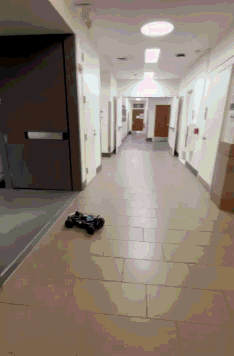
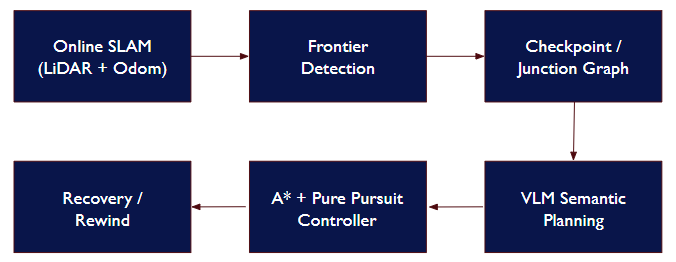
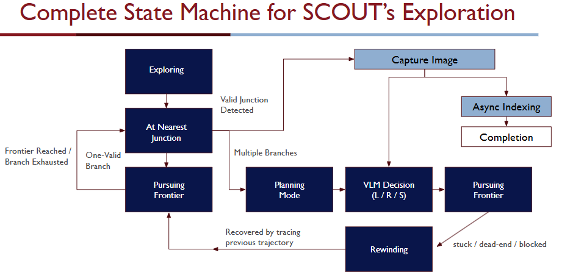
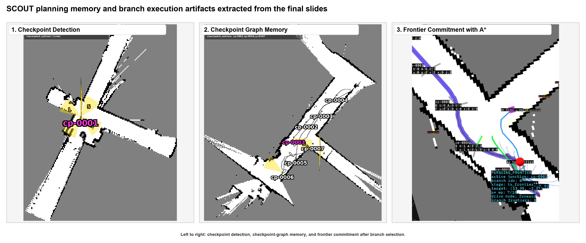
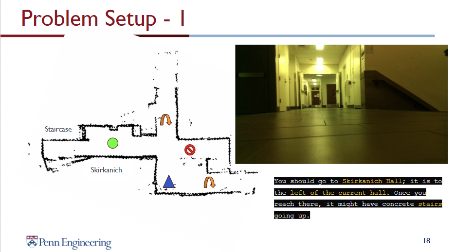
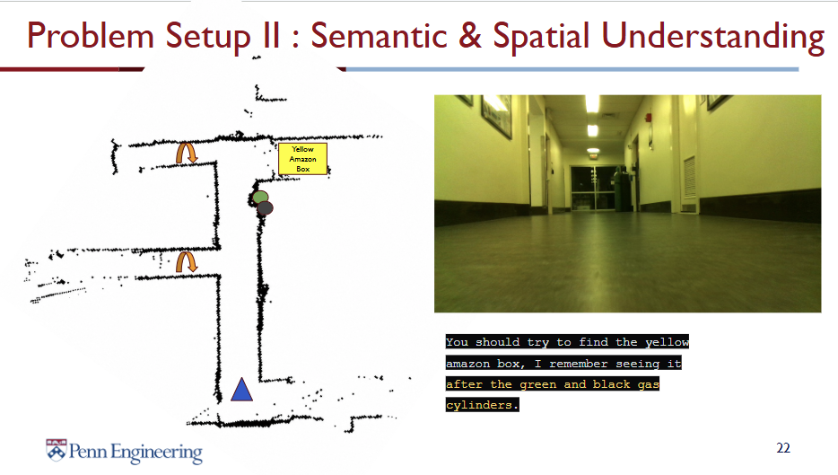
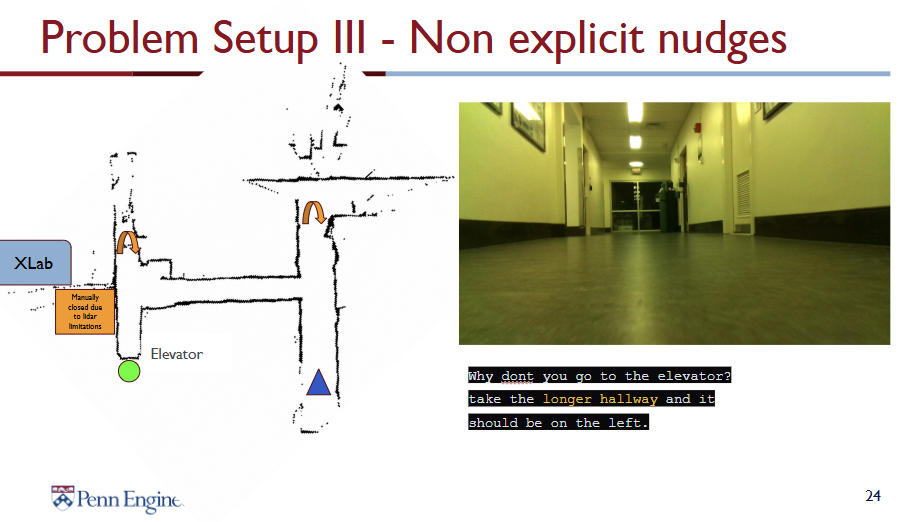

  

    
  

  

    <strong>SCOUT</strong> (<em>Semantically Checkpointed Online Unknown-space Traversal</em>) is an F1TENTH stack for navigating buildings the car has never seen. It runs online SLAM, remembers junctions as a graph, and asks a vision-language model to break ties at ambiguous intersections.
      
    Built for ESE 6150 at UPenn, Spring 2026, with <a href="https://github.com/wu52F">Tao Wu</a>, <a href="https://github.com/Amnx404">Aman Sa</a>, and <a href="https://github.com/dhyeyshah28">Dhyey Shah</a>. I owned the reactive local planner, the exploration state machine, and the VLM Semantic Planning.
  

## Why not just chase the nearest frontier?

Frontier exploration is myopic. It picks the closest patch of unknown space and discovers, too late, that the hallway it just committed to is a closet. On Ackermann steering the cost of a bad commitment is high — the car can't rotate in place, so dead ends mean expensive recovery.

SCOUT adds three things on top of frontier exploration:

- A **checkpoint graph** that remembers every multi-branch junction, with per-branch status (`unexplored / active / exhausted / blocked`).
- **Reachability scoring** — only frontiers A\* can actually reach are eligible.
- **A VLM at junctions** — Nemotron via OpenRouter reads an annotated planning image and picks left, straight, or right based on the mission prompt.

When every branch at a checkpoint dead-ends, the car rewinds along its breadcrumb trail to the nearest viable ancestor. No in-place rotation, no replanning from scratch.

## Architecture

The runtime is three ROS 2 nodes plus a shared core.

**`macro_node`** — the local planner. DBSCAN clusters LiDAR returns, an EKF tracks obstacles with comet-tail persistence, and 11 lattice candidates with an adaptive 0.35–4.0 m horizon are scored by

$$
J(\tau) = w_s \cdot C_{\text{safety}}(\tau) + w_v \cdot C_{\text{speed}}(\tau) + w_c \cdot C_{\text{clear}}(\tau).
$$

The winner is tracked by a curvature-adaptive Stanley controller.

**`exploration_node`** — the global brain. Detects and filters frontiers from `slam_toolbox`'s occupancy grid, spawns checkpoints when corridor geometry shows two or more exits, assigns nearby frontiers to branches via KD-tree, plans A\* paths to committed targets, and switches into a breadcrumb-replay rewind when the local planner reports everything blocked.

**`vlm_goal_node`** — the semantic layer. Renders the local map with junction arrows and frontier markers, builds a prompt from mission text and recent decisions, and calls the VLM under a strict output contract: it can only return one of the letters the exploration node published. A parallel asynchronous loop indexes camera frames into a small scene graph for landmark retrieval (gas cylinders, an Amazon box, elevator doors).

The state machine is `exploring → planning → pursuing → rewinding`. Planning is the only state that pauses driving, and only at multi-branch junctions, so the VLM's 2–5 s latency doesn't eat the control loop.

## What changed in the field

We tested in the Levine Hall corridors against (a) reactive Follow-the-Gap and (b) plain frontier navigation.

*Goal-directed search — find Skirkanich Hall, the one with the stairs:*

| Method | Steps to goal | Notes |
| --- | ---: | --- |
| Reactive FTG | did not finish | wrong turn, entered a loop |
| Frontier (no VLM) | 28 | exhaustive BFS-style search |
| **SCOUT** | **8** | VLM read the rendered junction and picked the staircase branch |

*Landmark search — find the yellow Amazon box, past the green-and-black gas cylinders:* the scene graph indexed both landmarks at the right junctions, retrieved them on the "Amazon" query, and rejected elevator doors as non-traversable despite their frontier signature.

*Spatial cues — go to the elevator, take the longer hallway:* a geometric planner would pick the closest frontier; SCOUT picked the branch with greater visible extent in the rendered map.

  
  
  

## What was hard

*Ackermann steering can't rotate in place.* Speed-adaptive lateral spread on the lattice, plus breadcrumb-replay rewind that drives back along proven trajectories instead of replanning from scratch.

*SLAM drift keeps moving the map.* Frontiers persist through temporary occlusion; the KD-tree refreshes on a schedule rather than every frame; checkpoint poses carry a drift tolerance.

*Branch commitment had to be stable.* The per-branch status tag plus a frontier-proximity filter near the driven trail kept the car from oscillating or revisiting exhausted branches.

*The VLM had to not hallucinate.* The exploration node publishes the set of valid letters for each junction; the prompt embeds that contract; a strict parser falls back to the nearest reachable frontier on any unparseable response.

*The control loop runs at 20–50 Hz.* VLM API calls take seconds, so scene indexing runs asynchronously, planning mode only triggers at multi-branch junctions, frontier detection runs at 2–5 Hz, and A\* paths are cached until the map changes meaningfully.

## What's next

Quantitative benchmarks against ROS nav2 exploration on public datasets; tighter semantic grounding by fusing the camera scene index with SLAM-aligned landmarks; multi-junction lookahead via value iteration over the checkpoint graph; local VLM inference to cut the 2–5 s decision latency.

---

[Source](https://github.com/wu52F/F1-Project-SCOUT)
&nbsp;·&nbsp; [Demo playlist](https://www.youtube.com/playlist?list=PLl8JsMDpAXU6AtBkSAOfZl8j6i4mdqPJG)
&nbsp;·&nbsp; [Final report (PDF)](/uploads/scout_project.pdf)
