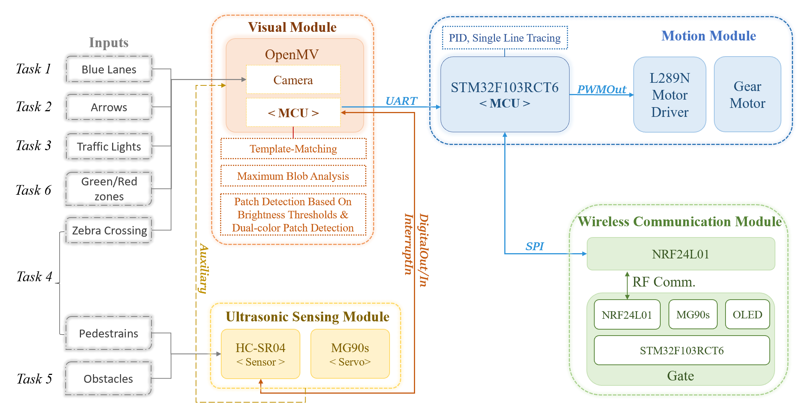
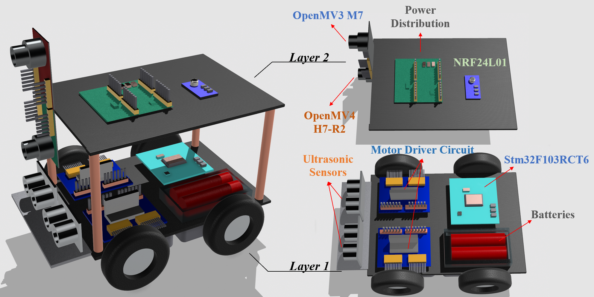
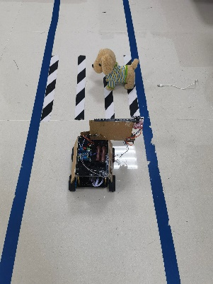
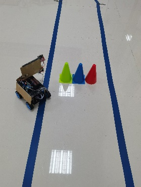
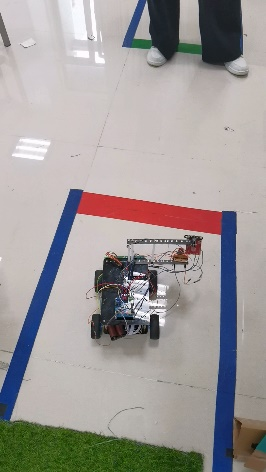
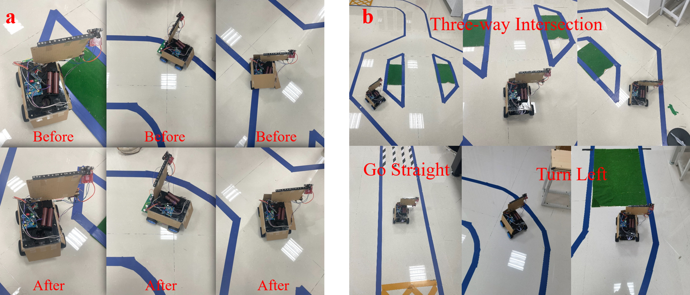

  

    <video style="width: 100%; height: 360px; object-fit: cover; border-radius: 10px; display: block;" autoplay muted loop playsinline controls preload="metadata">
      <source src="demo.mp4" type="video/mp4">
    </video>
  

  

    A 1/10-scale autonomous robot car built for the UESTC × Glasgow joint program's <strong>Team Design Project</strong> (Summer 2024) — six people, three months, one live demo. Six urban-driving tasks in a single 10-minute run, no manual intervention, ≤ 1000 RMB budget, no Raspberry Pi / Arduino. Final cost: 995.67 RMB. Demo at <em>10× speed</em>, silent.
      
    <strong>My role:</strong> motion-control and perception lead — custom motor-driver PCB, PID lane-tracking, and the OpenMV arrow/traffic-light pipeline.
  

## The six tasks

| # | Task | Approach | Result |
| --- | --- | --- | --- |
| 1 | Lane tracking | OpenMV3 line detection + PID | **> 98 %** |
| 2 | Arrow recognition | NCC parking stop + Maximum Color Blob Analysis | 80 – 100 % |
| 3 | Traffic-light recognition | Brightness-threshold color blocks | **85.7 %** |
| 4 | Crosswalk + pedestrian | Dual-color patch centroid + ultrasonic | **90 %** |
| 5 | Obstacle avoidance | Servo-scanning ultrasonic + lateral maneuver | reliable |
| 6 | Wireless gate communication | NRF24L01 @ 2.4 GHz over SPI | **90 %** |

## System architecture

Four subsystems sharing an **STM32F103RCT6** brain. The OpenMV boards run vision on-device and report decisions over UART; the STM32 owns motion, ultrasonics, and the radio link. Motor speed is PWM-modulated through a custom L298N H-bridge PCB; lane-tracking lives on its own OpenMV3 M7 so the pattern-recognition loop never blocks driving. The wireless link uses NRF24L01 over SPI between the car's STM32 and an identical pair on the gate, which drives an MG90S servo and an I²C OLED to acknowledge the open command.

## In the field

  
  
  

*Left to right: pedestrian-aware stop at the zebra crossing, obstacle avoidance around a cone, and wireless gate communication at the finish line.*

Lane tracking ended up at a **25 cm camera height with a 30° pitch**, PID gains of (distance 0.25, angle 0.4) — chosen after sweeping mount geometries and gains in the lab. The resulting controller holds the lane through complex three-way intersections and recovers cleanly when the car drifts onto the line.

## Team

Team No. 57 — UESTC × Glasgow joint program, Summer 2024: Zhang Yifei, Xu Xinyao, Zijin Zhou, Ni Binqin, Wang Zeping, Li Jiajun.
