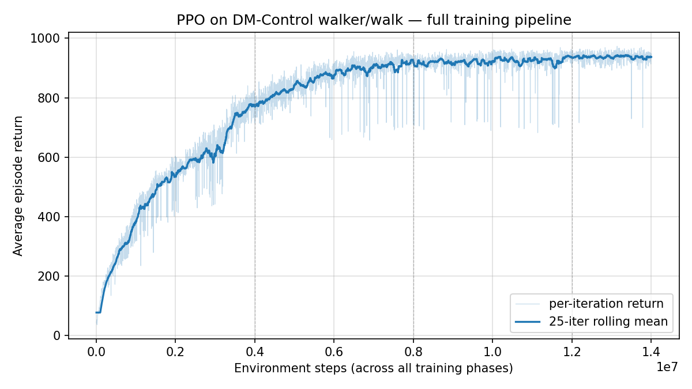

<div style="display: flex; gap: 1.5rem; align-items: center; flex-wrap: nowrap; margin-bottom: 1.5rem;">
  <div style="flex: 0 0 320px; max-width: 320px;">
    <video style="width: 100%; height: 360px; object-fit: cover; border-radius: 10px; display: block;" autoplay muted loop playsinline preload="auto">
      <source src="walker_demo.mp4" type="video/mp4">
    </video>
  </div>
  <div style="flex: 1 1 auto; min-width: 0;">
    Built for ESE 6500 (Learning in Robotics, UPenn, Spring 2026), this project trains a planar bipedal walker from <strong>DM Control</strong>'s walker-walk task using a from-scratch implementation of <strong>Proximal Policy Optimization</strong>.
    <br><br>
    The headline result isn't the algorithm itself — PPO is a known quantity — it's the <strong>symmetric policy</strong> trick that lets the walker actually <em>walk</em> instead of falling into the textbook failure mode of hopping forever on one leg.
  </div>
</div>

## A symmetric policy by construction

For a planar walker, swapping left ↔ right gives a physically identical state and action. So the policy *must* be left-right symmetric:

$$
\mu(\sigma(x)) = \sigma(\mu(x))
$$

where $\sigma$ is the left-right mirror permutation on observation space (or action space, respectively). Rather than penalizing this in the loss, I enforce it as a hard architectural constraint:

```python
def forward(self, x):
    mu = self._mu_raw(x)
    if self.symmetric:
        # Average the policy output with its own mirror image.
        mu_mirror = mirror_act_batch(self._mu_raw(mirror_obs_batch(x)))
        mu = 0.5 * (mu + mu_mirror)
    return mu, std
```

The policy literally cannot prefer one leg over the other — the mean of a mirror pair has zero asymmetry by construction. To keep the value function and obs-normalization consistent, every rollout batch is also augmented with its mirror image before the gradient step.



*Full training pipeline on walker-walk. The agent climbs to ~900 average return by roughly 6 M environment steps and plateaus around 940 through the rest of the 14 M-step run, on a max-1000 task.*

## PPO details

The implementation lives in `walker.py` (~400 lines) and follows the standard PPO-clip recipe:

- **Policy** — Gaussian over 6-d actions, 2-layer MLP (128 units, Tanh), fixed log-std at training time.
- **Critic** — 2-layer MLP with MSE Bellman regression.
- **GAE** — generalized advantage estimation with $\gamma=0.99$, $\lambda=0.95$; advantages normalized per batch.
- **PPO update** — clipped surrogate objective with $\epsilon = 0.2$, entropy bonus 0.01, gradient-norm clipping at 0.5, **KL early-stopping** if mean KL exceeds 0.015 (cuts off training at the right time without manual tuning of `pi_epochs`).
- **Observation normalization** — Welford-style running mean/std over the 24-d state; clipped to ±10.
- **Mirror augmentation** — every rollout batch is concatenated with its mirror image before fitting the critic and the obs-norm stats, so the critic also "sees both sides."

The PPO surrogate is the standard clipped objective with a KL penalty for early-stopping:

$$
L^{\text{CLIP}}(\theta) = \mathbb{E}\big[\min(r_t(\theta)\, A_t,\ \text{clip}(r_t(\theta), 1-\epsilon, 1+\epsilon)\, A_t)\big],\quad r_t = \frac{\pi_\theta(u_t \mid x_t)}{\pi_{\theta_\text{old}}(u_t \mid x_t)}.
$$

## Training trajectory

Walker-walk has a max episode return around 1000 (1 reward per step × 1000 steps when the agent is upright and moving).

| Steps | Result |
| ---: | --- |
| 0 | ep return ≈ 80 (random policy, falls almost immediately) |
| 2 M | ep return ≈ 600, mostly upright, gait still messy |
| 6 M | ep return ≈ 900, recognizable walking gait |
| 14 M | ep return ≈ 940, stable plateau |

The bulk of the learning happens in the first ~6 M environment steps; the remaining 8 M is mostly refinement and variance reduction. The plot above smooths each iteration's return with a 25-iteration rolling mean to make the trend legible against the per-iteration noise.

## What was actually hard

*The symmetry constraint had to be architectural, not loss-based.* I first tried a symmetry regularizer (add $\|\mu(x) - \sigma(\mu(\sigma(x)))\|^2$ to the loss). It softened the asymmetry but didn't break the basin of attraction — the hopping mode is too good a local optimum. Hard-coding the mirror average was the only thing that worked.

*Observation normalization needed mirror augmentation too.* Without it, the running mean/std picks up the asymmetric statistics of the (initially asymmetric) rollouts and bakes them into the policy via the input layer. Augmenting the obs-norm update with mirrored states fixes this.

*KL early-stopping is a quiet but huge win.* The Spinning Up reference does a fixed number of PPO epochs per iteration. Replacing that with "do up to 10 epochs but stop early if mean KL > 0.015" made the run roughly 2× faster and removed a finicky hyperparameter.

*Initialization matters more than the textbook lets on.* For the final report I tried both a fresh symmetric run and a fine-tune from an asymmetric hop checkpoint. Both work, but the fine-tune is faster — the value function and obs-norm transfer well, even though the policy basin of attraction is different.

Course: ESE 6500 Learning in Robotics, UPenn, Spring 2026.
